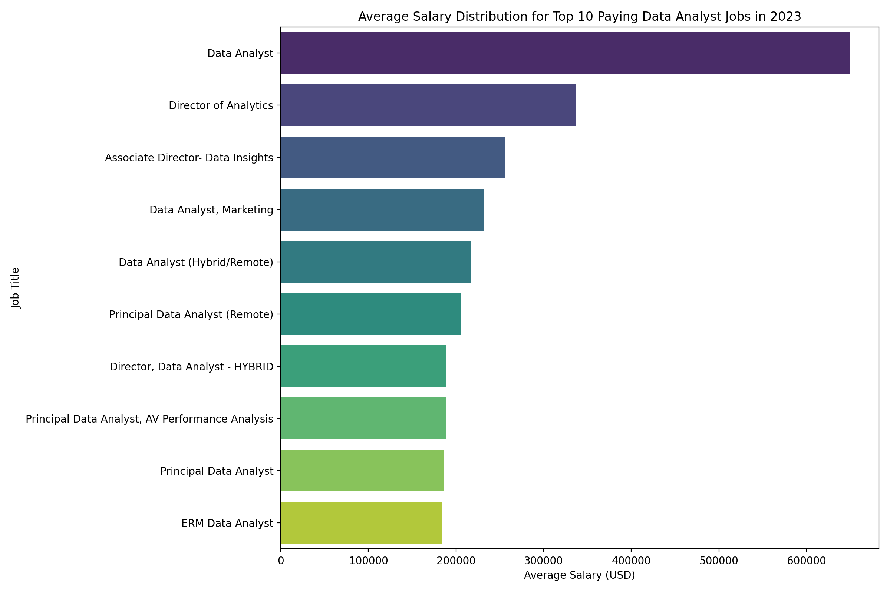
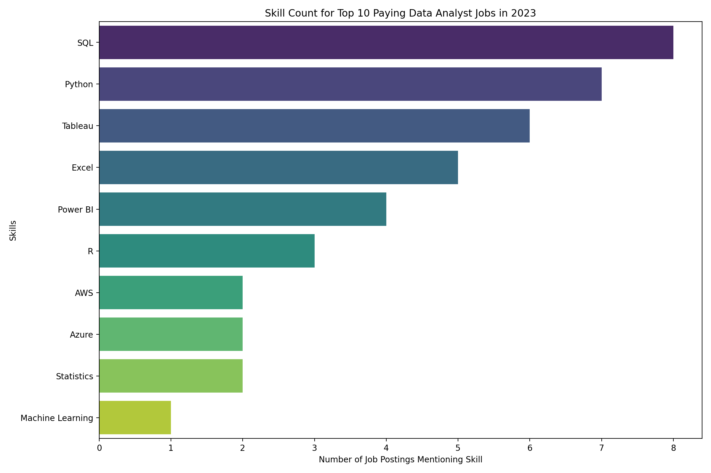

# Introduction
 Explore the data job market! Centered on data analyst positions, this project investigates lucrative roles and in-demand skills, revealing where significant demand aligns with attractive salaries in data analytics 📊
SQL queries? Check them out here: [project_sql folder](/project_sql/)
# Background
Motivated by the goal of efficiently navigating the data analyst job market, this project emerged from a wish to identify the highest-paying and most sought-after skills, simplifying the job search process for others to discover the best opportunities! Questions:

1. What are the top-paying data analyst roles?
2. What skills are required for these top-paying roles?
3. What skills are most in demand for data analysts?
4. Which skills are associated with higher salaries? 
5. What are the most optimal skills to learn?
# Tools I Used
For a deep dive into the data analyst job market, several key tools were used which are:

- **SQL :** The backbone of the analysis; enabling the querying of the database to uncover critical insights.
- **PostgreSQL :** The chosen Database management system for this project, ideal for data storage and retrieval.
- **Visual Studio Code :** My go-to preferred tool for database management, viewing tables, running migrations and executing SQL queries.
- **Git & GitHub :** Essential for version control that helps track changes in source code and ensuring collaboration among teams.
# The Analysis
Each query for this project focused on exploring specific aspects of the data analyst job market. Here’s how I tackled each question:

### 1. Top Paying Data Analyst Roles
To identify the highest-paying roles, I filtered data analyst positions by average yearly salary and location, focusing on remote jobs. This query highlights the high paying opportunities in the field.

```sql
SELECT 
    job_id,
    job_title,
    job_location,
    job_schedule_type,
    salary_year_avg,
    job_posted_date,
    name AS company_name
FROM
    job_postings_fact
LEFT JOIN company_dim ON job_postings_fact.company_id = company_dim.company_id
WHERE
    job_title_short = 'Data Analyst' AND
    job_location = 'Anywhere' AND
    salary_year_avg IS NOT NULL
ORDER BY
    salary_year_avg DESC
LIMIT 10;
```

Here's the breakdown of the top data analyst jobs
in 2023:
- **Job Title Variety :** There's a high diversity in job titles, from Data Analyst to Director of Analytics, reflecting varied roles and specializations within data analytics.

- **Wide Salary Range :** Top 10 paying data analyst roles span from $184,000 to $650,000, indicating significant salary potential in the field.



 *Bar graph visualizing salaries for the top 10 data analyst roles; Julius AI generated this graph from my SQL query results*

### 2. Skills for Top Paying Roles
To understand what skills are required for the top-paying jobs, I joined the job postings with the skills data, providing insights into what employers value for high-compensation roles.

```sql
WITH top_paying_jobs AS (
    SELECT 
        job_id,
        job_title, 
        salary_year_avg,
        name AS company_name
    FROM
         job_postings_fact
    LEFT JOIN company_dim ON job_postings_fact.company_id = company_dim.company_id
    WHERE
        job_title_short = 'Data Analyst' AND
        job_location = 'Anywhere' AND
        salary_year_avg IS NOT NULL
    ORDER BY
        salary_year_avg DESC
    LIMIT 10
)
SELECT 
    top_paying_jobs.*,
    skills
FROM top_paying_jobs
INNER JOIN skills_job_dim ON top_paying_jobs.job_id = skills_job_dim.job_id
INNER JOIN skills_dim ON skills_job_dim.skill_id = skills_dim.skill_id
ORDER BY
    salary_year_avg DESC;
 ```
 Here's the breakdown of the most demanded skills for the top 10 data analyst roles in year 2023:
- **SQL** is leading with a bold count of 8.
- **Python** follows closely with a bold count of 7.
- **Tableau** is also highly sought after, with a bold count of 6.
Other skills like Excel, Power BI, R, etc

 
 *Bar graph visualizing the count of skills for the top 10 paying jobs for data analysts; Julius AI generated this graph from my SQL query results*

### 3. In-Demand Skills for Data Analyst
This query help identify the skills most frequently requested in job postings, directing focus to areas with high demand.

```sql
 SELECT 
    skills,
    COUNT(skills_job_dim.job_id) AS demand_count
FROM job_postings_fact
INNER JOIN skills_job_dim ON job_postings_fact.job_id = skills_job_dim.job_id
INNER JOIN skills_dim ON skills_job_dim.skill_id = skills_dim.skill_id
WHERE 
    job_title_short = 'Data Analyst' AND
    job_work_from_home = True
GROUP BY
    skills
ORDER BY
    demand_count DESC
LIMIT 5;
```
Here's the breakdown of the most demanded skills for data analysts in 2023

**• SQL** and **Excel** remain fundamental, emphasizing the need for strong foundational skills in data processing and spreadsheet manipulation.

**• Programming** and **Visualization Tools** like **Python, Tableau, and Power BI** are essential, pointing towards the increasing importance of technical skills in data storytelling and decision support.

| **Skills**   | **Demand Count** |
|----------|--------------|
| SQL      | 7291         |
| Excel    | 4611         |
| Python   | 4330         |
| Tableau  | 3745         |
| Power BI | 2609         |

*Table of the demand for the top 5 skills in data analyst job postings*

### 4. Skills Based on Salary
 Looking at the average salary associated with each skill for Data Analyst positions. Focuses on roles with specified salaries, regardless of the location.

```sql
SELECT
    skills,
    ROUND(AVG(salary_year_avg), 0)AS avg_salary
FROM job_postings_fact
INNER JOIN skills_job_dim ON job_postings_fact.job_id = skills_job_dim.job_id
INNER JOIN skills_dim ON skills_job_dim.skill_id = skills_dim.skill_id
WHERE
    job_title_short = 'Data Analyst'
    AND salary_year_avg IS NOT NULL
    AND job_work_from_home = True
GROUP BY
    skills
ORDER BY
    avg_salary DESC
LIMIT 10;
```
Here's a breakdown of the results for top paying skills for Data Analyst positions:
- **High Demand for Big Data & ML Skills :** Top salaries are commanded by analysts skilled in big data technologies (PySpark, Couchbase), machine learning tools (DataRobot, Jupyter), and Python libraries (Pandas, NumPy), reflecting the industry's high valuation of data processing and predictive modeling capabilities.
- **Software Development & Deployment Proficiency :** Knowledge in development and deployment tools (GitLab, Kubernetes, Airflow) indicates a lucrative crossover between data analysis and engineering, with a premium on skills that facilitate automation and efficient data pipeline management.
- **Cloud Computing Expertise :** Familiarity with cloud and data engineering tools (Elasticsearch, Databricks, GCP) underscores the growing importance of cloud-based analytics environments, suggesting that cloud proficiency significantly boosts earning potential in data analytics.


| **Skill**         | **Average Salary ($)** |
|---------------|--------------------|
| pyspark       | 208,172            |
| bitbucket     | 189,155            |
| couchbase     | 160,515            |
| watson        | 160,515            |
| datarobot     | 155,486            |
| gitlab        | 154,500            |
| swift         | 153,750            |
| jupyter       | 152,777            |
| pandas        | 151,821            |
| elasticsearch | 145,000            |

*Table of the average salary for the top 10 paying skills for data analysts*

### 5. Most Optimal Skills to Learn
Combining insights from demand and salary data, this query aimed to pinpoint skills that are both in high demand and have high salaries, offering a strategic focus for skill development.

```sql
SELECT
    skills_dim.skill_id,
    skills_dim.skills,
    COUNT(job_postings_fact.job_id) AS demand_count,
    ROUND(AVG(job_postings_fact.salary_year_avg), 0) AS avg_salary
FROM job_postings_fact
INNER JOIN skills_job_dim ON job_postings_fact.job_id = skills_job_dim.job_id
INNER JOIN skills_dim ON skills_job_dim.skill_id = skills_dim.skill_id
WHERE
    job_title_short = 'Data Analyst'
    AND salary_year_avg IS NOT NULL
    AND job_work_from_home = True
GROUP BY
    skills_dim.skill_id
HAVING
    COUNT(skills_job_dim.job_id) > 10
ORDER BY
    avg_salary DESC,
    demand_count DESC
LIMIT 25;
```


| **Skill ID** | **Skills**       | **Demand Count** | **Average Salary ($)**|
|----------|--------------|--------------|----------------|
| 8        | Go           | 27           | $115,320       |
| 234      | Confluence   | 11           | $114,210       |
| 97       | Hadoop       | 22           | $113,193       |
| 80       | Snowflake    | 37           | $112,948       |
| 74       | Azure        | 34           | $111,225       |
| 77       | BigQuery     | 13           | $109,654       |
| 76       | AWS          | 32           | $108,317       |
| 4        | Java         | 17           | $106,906       |
| 194      | SSIS         | 12           | $106,683       |
| 233      | Jira         | 20           | $104,918       |
| 79       | Oracle       | 37           | $104,534       |
| 185      | Looker       | 49           | $103,795       |
| 2        | NoSQL        | 13           | $101,414       |
| 1        | Python       | 236          | $101,397       |
| 5        | R            | 148          | $100,499       |
| 78       | Redshift     | 16           | $99,936        |
| 187      | Qlik         | 13           | $99,631        |
| 182      | Tableau      | 230          | $99,288        |
| 197      | SSRS         | 14           | $99,171        |
| 92       | Spark        | 13           | $99,077        |
| 13       | C++          | 11           | $98,958        |
| 186      | SAS          | 63           | $98,902        |
| 7        | SAS          | 63           | $98,902        |
| 61       | SQL Server   | 35           | $97,786        |
| 9        | JavaScript   | 20           | $97,587        |

*Table of the most optimal skills for data analyst sorted by salary*


# Practical Experience

Throughout this journey, I, Victor Essen, have significantly enhanced my SQL skills with substantial expertise:

- **Advanced Query Crafting :** Perfected the art of complex SQL, seamlessly joining tables and leveraging WITH clauses for sophisticated temporary tables.

- **Data Aggregation Mastery :** Gained proficiency with GROUP BY, making aggregate functions like COUNT() and AVG() my go-to tools for summarizing data.

- **Analytical Precision :** Sharpened my real-world problem-solving abilities, translating complex questions into actionable, insightful SQL queries.
# Conclusions 
# 💡 Insights into this project

### Most In-Demand Skills:

- Most In-Demand Skills are programming and visualization tools like **Python, Tableau, and Power BI**. Also Strong foundational skills in **SQL and Excel**.

 - High-paying data analyst roles consistently require advanced **SQL, Python** expertise; emphasizing their role as a critical skills for maximizing salary potential.


### **Skills Associated with Higher Salaries:**

- **Big Data & ML Skills**: Analysts with expertise in big data tools (like PySpark) and machine learning (such as DataRobot) command high salaries, reflecting industry demand.

- **Development Proficiency**: Skills in deployment tools (like GitLab and Kubernetes) indicate a valuable intersection between data analysis and engineering, emphasizing automation.

- **Cloud Computing**: Knowledge of cloud technologies (like Elasticsearch and GCP) highlights their importance in analytics, suggesting that cloud skills enhance earning potential.

